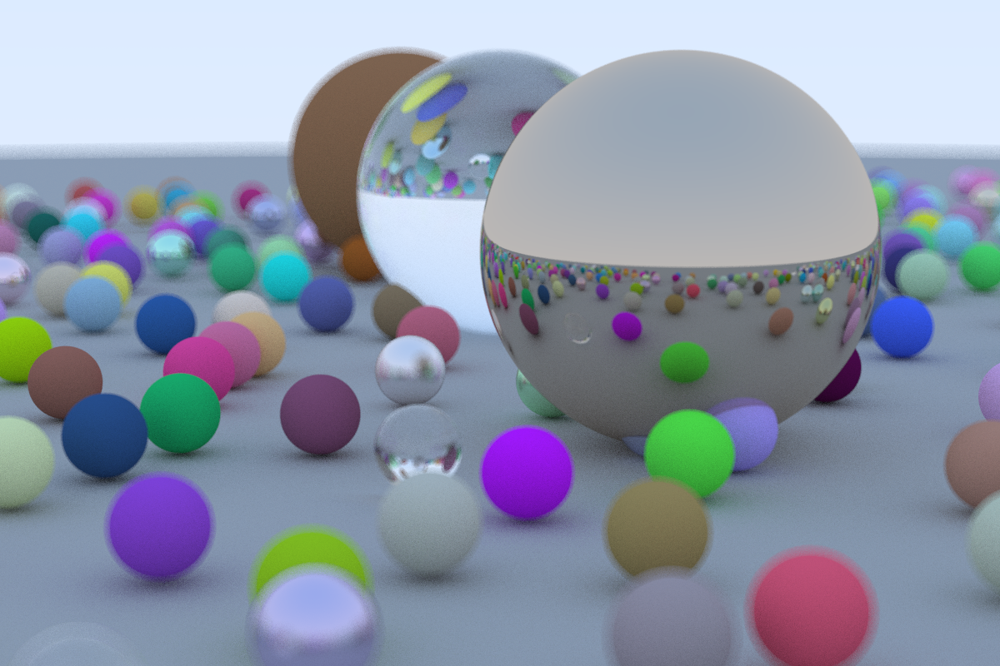
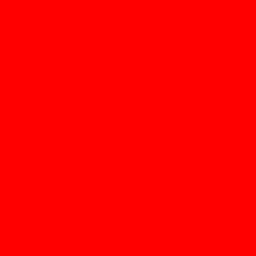
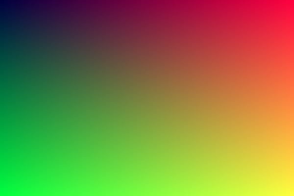
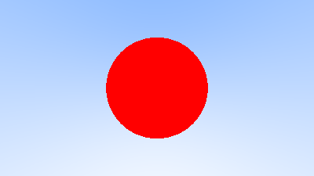
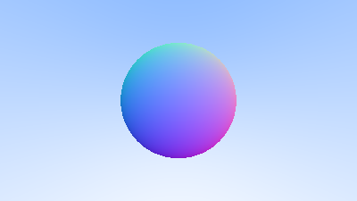
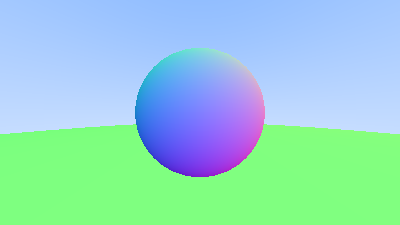
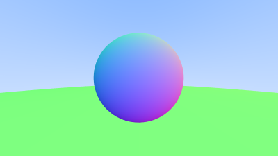
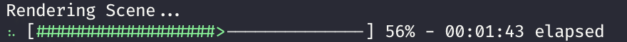
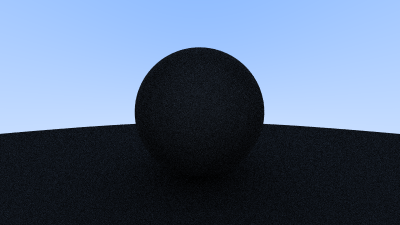
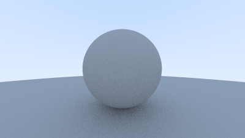

# Raytracer Project

For those of you not familiar with raytracing, it's a 3d graphics rendering technique that works by modelling light rays that's used becoming more common as a technique in modern gaming (thanks to NVIDIA). Ray tracing is a bit of an umbrella term, but what we're gonna build is technically a path tracer, and a fairly general one. You'll eventually end up with an image something like this:



This tutorial is adapted from the excellent [_Ray Tracing in One Weekend_](https://raytracing.github.io/), amd also utilises some of the really helpful illustrations from there. I've rewritten it from C++ to Rust, and also added a few other bits to hopefully make it more interesting and explore a few more bits of Rust. This is only an adaptation of the first book, so if you get to the end of this and want to explore more, the next two books are certainly worth a read, though you'll have to [carcinise](https://en.wikipedia.org/wiki/Carcinisation) it yourself (or do it in C++, which despite all it's problems is still widely used and a good skill to have).

There's a fair amount of vector maths involved here but don't let that intimidate you. I'll try to explain it all well enough that you don't need a maths degree to follow whats going on.

Also, unlike the original book, I'm not going to give you the code snippets as we go because you'll just copy and paste them. Feel free to take a look at the solutions if you get stuck, but try to solve the tasks yourself as you'll find it much more rewarding. Remember to make use of your resources!

## 1: Images

What does a renderer render? Well... pictures. An image of a scene. So we're going to need some way to output an image in Rust. We're going to take advantage of the excellent crates.io ecosystem here and use a crate called [image](https://github.com/image-rs/image) that does pretty much exactly what it says on the tin: provide tools for working with images. Have a look over the docs over on [docs.rs](https://docs.rs/image/latest/image/) and have a think about how you might go about creating a new image.

We don't need to support any fancy encoding or anything for our raytracer, we just want each pixel to be comprised of 3 bytes: the good old `(r, g, b)`.

### Task 1.1

I'm assuming you've already created a new cargo project and added `image` to your dependencies in `Cargo.toml`. In your main function, write some code to generate an image and save it to disk. The basic steps are something like:

- Create a new image buffer to hold our pixels ([docs](https://docs.rs/image/latest/image/struct.ImageBuffer.html)). 256x256 should be good to start with.
- Iterate over each pixel ([docs](https://docs.rs/image/latest/image/struct.ImageBuffer.html#method.enumerate_pixels_mut))
  - Modify each pixel, setting it to a single colour (red) to start with ([docs](https://docs.rs/image/latest/image/struct.Rgb.html))
- Save the buffer to a file ([docs](https://docs.rs/image/latest/image/struct.ImageBuffer.html#method.save))

Your image should be saved to disk, and look like this:



### Task 1.2

We're gonna extend the code from above to output something a bit nicer. From here on out, I'm going to talk about RGB values as being floats from 0.0 to 1.0. Converting them to bytes can be done just before you write to the pixel. I'm also going to refer to `i` and `j` as the coordinates of each pixel, where `i` is the offset in columns from the top-left corner, and `j` is the offset in rows (if you're not already using an iterator that does this for you, try find it in the `image` documentation).

For each pixel:

- Scale `i` to the range 0.0-1.0 based upon the image's width. This will be your `r` value.
- Scale `j` to the range 0.0-1.0 based upon the image's height. This will be your `g` value.
- Fix `b` at 0.25
- Convert your rgb values to bytes
- Write your pixel to the buffer.

Red will fade from 0 to 1 left to right, and green will fade in from top to bottom. You should get a nice gradient like this:



This is a sort of graphics "Hello World", because once we have an image we can do what we want with it.

## 2: Vectors

Almost all graphics programs have some data structures for storing geometric vectors and colors. In many systems these vectors are 4D (3D plus a homogeneous coordinate for geometry, and RGB plus an alpha transparency channel for colors). For our purposes, three coordinates is just fine. We’ll use the same struct `Vec3` for colors, locations, directions, offsets, whatever. Some people don’t like this because it doesn’t prevent you from doing something silly, like adding a color to a location. They have a good point, and we could enforce this through Rust's type system, but we're going to not for now because it adds a lot of complexity. We will create some type aliases `Colour` and `Point`, though, to make our types a little more descriptive where possible.

### Task 2.1

Our `Vec3` will require a few methods to make it useful in graphics applications:

- [Dot](https://www.mathsisfun.com/algebra/vectors-dot-product.html) and [cross](https://www.mathsisfun.com/algebra/vectors-cross-product.html) products
- A `len()` method, to get it's magnitude
- A `normalise()` method, to scale a vector to unity magnitude.
- A `to_rgb()` method that converts a vector with all all 0.0-1.0 values to an `image::Rgb`.
- A `map()` method, that applies a function to each element of the vector, consuming it and returning a new vector, similar to the `map()` method for arrays.

Create a new `vector.rs` file, and include it in the module tree with a `mod vector;` statement in main. Then create a simple struct, `Vec3`, with three `f64` fields: x, y, z. Then, implement all these methods on it. Start with `dot()` and `len()`, then try `cross()`. Do `map()` next, as you can use it to then implement `to_rgb()` and `normalise()`. Look at the docs for [std::array::map](https://doc.rust-lang.org/std/primitive.array.html#method.map) for help with your map implementation, you want to take some function as an argument, and apply it to all 3 elements in your vector.

Add two type aliases `pub type Colour = Vec3` and `pub type Point = Vec3` too, You can add any other general vector methods you think might come in handy too.

### Task 2.2

We'll also want to overload some operators. Operator overloading allows operators to be implemented to work on custom types, which is done in Rust by implementing the [`std::ops`](https://doc.rust-lang.org/std/ops/index.html) traits. You want to be able to:

- Add two vectors
- Subtract two vectors
- Multiply a vector with a float
- Divide a vector by a float
- Negate a vector
- Multiply a vector element-wise by another vector

Implementing all of these means a lot of boilerplate, but we can draft in another crate to help us: [`derive_more`](https://github.com/JelteF/derive_more), which extends the `#[derive]` macros we're familiar with by allowing us to derive more traits, including operators. Add it to your `Cargo.toml` and have a look at the docs to see how to use it. Add derives for `Add`, `Sub`, `Mul`, `Div`, and `Neg`. You can also derive a `Constructor`! Add `Debug`, `PartialEq`, and `PartialOrd` while you're at it too.

Our vector is only 24 bytes, so can be considered cheap enough to derive `Copy` and `Clone` for it too. Remember that this disregards move semantics for the vector to let the compiler automatically make copies of it where needed.

`derive_more` isn't perfect, so we need to add a few operator overloads manually. `Mul<f64> for Vec3` is derived for us, which gives us `mul(Vec3, f64)`, but not the other way round (Rust does not assume that multiplication is commutative when implementing these traits). We can get the other way round with an `impl Mul<Vec3> for f64`, so we technically implement the trait again for the `f64` type. Take a look at the docs for [`std::ops::Mul`](https://doc.rust-lang.org/std/ops/trait.Mul.html) to work out how to do this.

There's also one or two cases where we want to multiply a vector by another vector element-wise. Add another `Mul` implementation for `Vec3` to do this.

### Task 2.3

We're gonna take a quick adventure down the rabbit hole that is Rust macros to create a ~~dirty hack~~ shorthand for initialising new vectors, since we're going to be doing an awful lot of it. I recommend having a read through [this blog post](https://blog.logrocket.com/macros-in-rust-a-tutorial-with-examples/), and some of the [Rust by Example](https://doc.rust-lang.org/rust-by-example/macros.html) chapter, then I'll walk you through it.

Declarative macros are just functions that operate on syntax. Our macro is declared using `macro_rules!`, and we'll call it `v!` (because its for vectors).

```rust
macro_rules v! {
    //patterns
}
```

The arguments are declared using syntax similar to `match`: `() => {}`. The macro matches on the pattern in the parentheses, and then expands to the code in the braces. In the parentheses goes the arguments to the macrom, which are Rust syntax items, specified like `$x: ty`, where `$x` is the name of the token, and `ty` is the type of the syntax token. Theres a few kinds of tokens, but we'll just use `expr` for now, which matches any expression, which most things are in rust.

```rust
macro_rules v! {
    ($x: expr) => {
        Vec3::new($x, $x, $x)
    }
}
```

The macro above takes a single expression as an argument, and replaces it with a call to `Vec3::new` with the same expression as all 3 arguments. A call to `v!(1)` will be expanded to `Vec3::new(1, 1, 1)`. We don't have to just use numbers though, the macro can be called on _any valid expression_.

We're going to add another pattern too to create a vector with three different arguments. The macro will pattern match on the two sets of arguments, and expand the one that matches. If no patterns match, the code won't compile.

```rust
macro_rules! v {
    ($x: expr, $y: expr, $z: expr) => {
        Vec3::new($x, $y, $z)
    };
    ($x: expr) => {
        Vec3::new($x, $x, $x)
    };
}
```

We'll add another neat little trick too. The `f64::from` uses the [`From`](https://doc.rust-lang.org/std/convert/trait.From.html) trait to accept any value that can be easily converted to an f64, and returns the float. For example, we can do `f64::from(0_u8)`, `f64::from(0_i32)` and `f64::from(0.0_f32)`, and get `0.0_f64` from all of them. Using this in our macro lets it be a little more flexible.

```rust
#[macro_export]
macro_rules! v {
    ($x:expr, $y: expr, $z: expr) => {
        Vec3::new(f64::from($x), f64::from($y), f64::from($z))
    };
    ($x:expr) => {
        Vec3::new(f64::from($x), f64::from($x), f64::from($x))
    };
}
```

The `#[macro_export]` annotation at the top tells Rust to export our macro at the crate root so other modules in our crate can use it with `use crate::v`. Exporting/using macros is a bit funky in Rust, but don't worry about it too much for now.

## 3: Rays

All ray tracers need some data type to represent rays. Think of a ray of a function $\mathbf P(t) = \mathbf A + t\mathbf b$.

- $\mathbf P$ is a position on a line in 3 dimensions
- $\mathbf A$ is the ray origin
- $\mathbf b$ is the direction the ray is pointing

Using this, you can plug in a different parameter `t` to get a position anywhere on the line/ray.


### 3.1

Create a new `ray` module. Create a new struct in it that stores the origin `Point` and direction `Vec3` of a ray, and add a method `Ray::at(&self, t: f64) -> Point` that returns the point in 3d space that is `t` units along the ray. Either create or derive a constructor for your `Ray` too.

### 3.2

Now we have rays, we can finally trace some. The basic concept is that the ray tracer casts rays from a "camera" and through each pixel, calculating the colour of each pixel. Like light, but in reverse. We'll start with a simple camera defined with a few basic parameters, and a `ray::colour` function that computes the colour of a ray.

Our basic image will use a 16:9 aspect ratio, because it's common, and because with a square image its easy to introduce bugs by accidentally transposing `x` and `y`. We'll also set up a virtual viewport that our rays will pass through into our scene, that will be two units wide and one unit away from the camera. The camera will be at $(0, 0, 0)$, with the `y` axis going up and `x` to the left. To respect the convention of a right handed coordinate system, into the screen is the negative z-axis. We will traverse the screen from the upper left hand corner, and use two offset vectors $\mathbf u$ and $\mathbf v$ along the screen sides to move the ray across the screen.


- Define your aspect ratio as `16/9`, your width as 400, and your height accordingly.
- The viewport height should be 2, and width should be set accordingly as per the aspect ratio.
- The focal length should be 1
- Looking at the diagram above, we can see that the top left corner lies at $\mathbf O - \mathbf x /2 + \mathbf y/2 - \mathbf f$
  - $\mathbf x$ and $\mathbf y$ are your image height and width vectors
  - $\mathbf f$ is your focal length vector

Write a `colour(&Ray) -> Colour` function that just always returns `v!(0, 1.0, 0)` for now, we'll add a nice pattern later. Update your loop in your `main` function to calculate the direction vector of the ray to cast on each iteration based on `i` and `j`, and then create a ray starting at the origin and going into the pixel. You can do this by scaling your pixel coordinate from 0 to 1, and then multiplying by your height and width vectors. Colour your ray and save the pixel value to the buffer calling `Vec3::to_rgb` to convert your colour from 0-1 from 0-255. Take care to get your signs right here so your vectors are all going in the same direction.

You should get a nice green rectangle. I appreciate theres a lot going on there, so ask for help or take a look at the solutions if you're not sure.

### 3.3

To make the background for our raytraced image, we're gonna add add a nice blue-white gradient. In your colour function, add code to normalise the ray's direction vector, then scale it from $0 \leq t \leq 1$ from $-1 \leq t \leq 1$. We're then gonna do a neat graphics trick called a lerp, or linear interpolation, where we blend two colours: `blended_value = (1-t) * start_value + t * end_value`. Use white for your starting colour, a nice `(0.5, 0.7, 1.0)` blue for your end colour, and blend based upon the y coordinate. You should end up with something like:


If your colours don't look similar, or it's upside down, check your geometry is correct.

## 4: Spheres

Spheres are often used in raytracers because its fairly easy to work out if a ray has hit one or not. The equation for a sphere centred at the origin with radius $r$ is:

$$
x^2 + y^2 + z^2 = r^2
$$

This means that for any given point $(x, y, z)$, if it is $r$ distance from the origin, the equation will be satisfied. If the sphere is at centre $(C_x, C_y, C_z)$, then the equation gets uglier:

$$
(x - C_x)^2 + (y - C_y)^2 + (z - C_z)^2 = r^2
$$

We need to get our equation in terms of vectors instead of individual coordinates to work with them in a graphics context. Using $\mathbf P = (x, y, z)$ and $\mathbf C = (C_x, C_y, C_z)$, the vector from $\mathbf C$ to $\mathbf R$ is $(\mathbf P - \mathbf C)$, so the equation of our sphere in vector form is:

$$
(\mathbf P - \mathbf C) \cdot (\mathbf P - \mathbf C) = r^2
$$

We want to know if our ray $\mathbf P(t)$ ever hits the sphere. We're looking for some $t$ where the following is true:

$$
(\mathbf P(t) - \mathbf C) \cdot (\mathbf P(t) - \mathbf C) = r^2
$$

$$
(\mathbf A + t \mathbf b - \mathbf C) \cdot (\mathbf A + t \mathbf b - \mathbf C) = r^2
$$

A little vector algebra and we have:

$$
t^2 \mathbf b \cdot \mathbf b + 2t \mathbf b \cdot (\mathbf A - \mathbf C) + (\mathbf A - \mathbf C) \cdot (\mathbf A - \mathbf C) - r^2 = 0
$$

The only unknown in that equation is $t$, so we have a quadratic. We can use everyone's favourite, the quadratic formula, to find a solution.

$$
t = \frac{-b \pm \sqrt{b^2 - 4ac}}{2a}
$$

$$
a = \mathbf b \cdot \mathbf b
$$

$$
b = 2 \mathbf b \cdot (\mathbf A - \mathbf C)
$$

$$
c = (\mathbf A - \mathbf C) \cdot (\mathbf A - \mathbf C) - r^2
$$

There are three possible cases, which the determinant of the formula (the $b^2 - 4ac$ bit), will tell us:


Empowered with some A-level linear algebra, we can go forth and draw balls.

### 4.1

Create another file `object.rs` that will contain code to do with objects. In there, create a new struct `Sphere` that holds the centre point and radius. Derive a constructor for it. Implement a method `hit` that takes a ray as an argument, and returns `true` if there is at least one intersection, and false otherwise.

Add a call to `Sphere::hit` in your `ray::colour` function, checking for intersection with a sphere with radius `0.5` centred on `(0, 0, -1)`. If there is a hit, return red instead of our usually lovely lerp background from earlier. The result:



You have a basic ray tracer that can calculate intersections, congrats! This has zero bells and/or whistles so far, but we'll get to shading and reflection later on.

### 4.2

How long did that take to execute on your machine? You might notice the raytracer starting to chung from here on out, because its doing a lot of maths, and it'll start to do a lot lot more maths as we add more code. This is technically what GPUs are for, but that's a whole other rabbit hole. We can do a few things to increase performance though. Introducing, my favourite crate: [`Rayon`](https://github.com/rayon-rs/rayon).

Rayon is a data parallelism library, that works by converting your iterators to parallel iterators, and then distributing work accross all the cores in your system. We're going to re-write our main rendering loop as an iterator, and then drop rayon in to make it (hopefully, depending on how many cores you have) a lot faster.

Where we are using for loops, we generally convert them to iterators using the [`for_each`](https://doc.rust-lang.org/stable/std/iter/trait.Iterator.html#method.for_each) adaptor, which just calls a closure on each item of an iterator. The two examples below are equivalent.

```rust
for x in 0..10_u32 {
    //loop body
    let y = f64::sqrt(x.into());
    println!("sqrt(x) = {y}");
}
```

to:

```rust
(0..10_u32).for_each(|x| {
    //the same loop body
    let y = f64::sqrt(x.into());
    println!("sqrt(x) = {y}");
})
```

Convert your rendering loop in `main` to use `for_each`. Then, import Rayon's prelude with `use rayon::prelude::*`, and add a call to [`par_bridge`](https://docs.rs/rayon/latest/rayon/iter/trait.ParallelBridge.html#tymethod.par_bridge) before your `for_each` to use Rayon's parallel bridge to parallelise your iterator. Run your code to make sure nothing is broken, and you should notice a speedup.

Another easy way to get free speed is to run in release mode. Instead of just `cargo run`, doing `cargo run --release` will compile your code with optimisations and no debug symbols to help speed it up, at the cost of longer compile times.

There are more efficient ways to utilise rayon than this (notably `par_bridge` is not as performant than regular parallel iterators), and additional optimisations that can be enabled in rustc. I encourage you to play around with it and experiment to see what makes the renderer fastest.

## 5: Surface Normals & Multiple Objects

### Task 5.1

A surface normal is a vector that is perpendicular to the surface of an object. You, stood up, are a surface normal to the planet earth. To be able to shade our sphere, we need to know the surface normal at the point where the ray intersects with the sphere.


We'll normalise our normals (make them unit vectors), and visualise them using a colour map, scaling the vector elements from the range $-1 \leq x \leq 1$ to $0 \leq x \leq 1$. This means we need to do two things.

First, change your hit function to return the solution to the quadratic equation if the ray and sphere intersect, and return nothing if the ray misses.

Next, re-write your colour function to do the following:

- Check if the ray and sphere intersect
  - If they do, use the `Ray::at()` function from earlier to find the exact point $P$ where, and then find the surface normal using $P - C$
    - Normalise the surface normal and scale it to the range $0 \leq x \leq 1$
    - Return this as a colour to shade your sphere
  - If they do not, then just return then same background colour as before

You should get this lovely image of a shaded sphere:



### Task 5.2

One sphere is boring, lets have some more. And more than just spheres too! Let's create a trait to represent objects so we can easily extend our raytracer with whatever we want. The `Object` trait will contain our `hit()` function, so any shape/object/thing can then implement it to be able to tell us if a ray has hit it or not.

We'll extend the `hit()` function a bit here to, to be something more like `fn hit(&self, ray: &Ray, bounds: (f64, f64)) -> Option<Hit>`. The `bounds` will specify valid bounds for the parameter `t` (the solution of our quadratic equation) to lie in, and
the `Hit` struct will bundle some more detailed information about a ray-object intersection. `Hit` will include:

- The `Point` where the intersection is
- The surface normal
- The parameter `t`

Create the `Hit` struct, add the `Object` trait with it's one function, and then implement it for `Sphere`. The old `Sphere::hit()` can go, as the new and improved `Sphere::hit()` should be part of the `Object` impl. You still need to determine if there is an intersection or not using the same calculations as before, but you'll now need to do some additional maths to find the closest of the two roots that is in within the bounds given. Calculate the surface normal and the intersection point here too, and return it all in the `Hit` struct. If there is no intersection, continue to return `None`.

Update your colour function to use the `Object` trait implementation of `Sphere::hit`. Put the bounds as $0 < x < \infty$ for now, so all intersections in front of the camera are valid. Also update it to deal with the new return type, but doing the same thing as before, shading based upon the normal. Make sure there's no change from the last task so you know everything is working.

### Task 5.3

We need to talk about surface normals again. The normal can either point outside the sphere, or be negated and point inside. The normal we're finding at the moment will always point against whichever side the ray hits from (rays will start to hit spheres on the inside when we get to glass). We need to know which side a ray hits from, and also need to introduce some consistency in which direction normals point.


To make this as easy as possible, we're going to make normals always point outward, and then store in the `Hit` struct which side of the object the ray hit. Add a boolean field called `front_face` to the struct, that will be `true` when the ray hits the outer surface, and `false` when it hits the inner surface.

The normalised outer surface normal can be calculated by $(P - C)  * \frac{1}{r}$. We can then use a property of the dot product to detect which side the ray hit from:

$$
\frac{\mathbf x \cdot \mathbf y}{ |\mathbf x||\mathbf y| } = \cos \theta
$$

Where $\theta$ is the angle between the two vectors joined tip-to-tip. This means that if the dot product of two vectors is 0, they are perpendicular. If the product is positive the two are at angles of less than 90 degrees, and if negative they lie at angles of between 90 and 180 degrees. So, if `ray.direction.dot(outward_normal) > 0`, then the ray has hit from the inside and we need to invert our normal and set `front_face` to false.


Implement this logic in your code, making sure that in the current render `front_face` is always true. If there's any bugs in your implementation you might not catch them all now because we have no cases where `front_face` is false yet, so double and triple check your maths. You could shuffle the sphere and camera positions around to put the camera _inside_ the sphere, and see what your results look like.

### Task 5.4

We have implemented `Object` for `Sphere`, but what about multiple spheres? We don't want to check _every_ object for intersection for each ray, so we're going to implement `Object` for a list of `Objects`. Well how is that going to work, can you implement a trait for a list of itself? Yes, you can. We're going to use [trait objects](https://doc.rust-lang.org/book/ch17-02-trait-objects.html). Trait objects are pointers to types, where the only thing known about that type is that it implements a specific trait. If you're familiar with dynamic dispatch, this is dynamic dispatch in Rust. We can create a `Vec<dyn Object>`, which Rust reads as "a list of items which all implement `Object`, and I don't care about the type of them beyond that".

Create a type alias for an entire scene as `pub type Scene = Vec<dyn Object>`. The compiler is now probably throwing you an error. We don't know what the size of `dyn Object` is at compile time, so we can't just put it into a `Vec` so easily. We need to put all our types in boxes, which are smart pointers that work with data of unknown size on the heap. If you haven't figured it out already, what you actually want is `Vec<Box<dyn Object>>`.

Now we have the type nailed down, implement `Object for Scene`. The idea is you return the `Hit` that is closest to the camera, so the one with the smallest `t`. Being able to do this provides some nice abstraction, as we can just check if the ray intersects anywhere in the scene, and get back the `Hit` for the closest object, which is the one the ray actually wants to hit.

The code you wrote using rayon earlier might be complaining now. Rust is very strict about what types can work with multithreaded code, which it enforces though the [Send and Sync traits](https://doc.rust-lang.org/book/ch16-04-extensible-concurrency-sync-and-send.html). Rust doesn't know for sure that a `dyn Object` is safe to share between threads, so we need to add a `Sync` bound on our type signature to tell the compiler that everything in this list should be an `Object`, but also `Sync`. All our types implementing `Object` will automatically be `Sync`, so we don't need to worry about this beyond letting the compiler and rayon know we have everything under control. Change your type signature again to be `Vec<Box<dyn Object + Sync>>`, and that should shut the compiler up.5

### Task 5.5

In main, add another sphere at `(0, -100.5, -1)` with radius 100, and then add both your spheres into a `Vec` to create a `Scene`. Change your colour function to take anything that implements `Object` (use generics or `impl` syntax for this, not trait objects again), and you should end up with something like this:



Note how the top of our little sphere is a similar colour to the top of our big sphere? It's because the ray is hitting them at similar angles, so the surface normal is similar.

## 6: Antialiasing

You might have noticed the slightly jagged edges on your sphere. This isn't the case with real cameras, because the edge pixels are a blend of the foreground and background. To achieve this, we're going to add antialiasing, which we'll acheive by taking multiple samples of each pixel and averaging them out.

### 6.1

So that each sample isn't identical, we're going to slightly randomise the ray directions within each pixel, for which we will use our old friend, the `rand` crate. Add it to your package manifest. `rand::random::<T>()` is a generic function that will return a random `T`. In case of floats, `rand::random::<f64>()` returns a random number $0 \leq x < 1$.

In your main rendering loop, add a slight randomness to your ray direction by adding a random float to your _pixel_ coordinate. Don't add it to your ray direction, add it _before_ you divide by image size. This detail is important otherwise you'll be casting rays all over the place and your render will be totally fucked.

Add a variable `let samples = n` to the top of `main`. Update the render loop to take `n` random samples of each pixel, and then set the final pixel colour to the average of the `n` samples. Your render should be the same, but with less jagged edges. Zoom in around the edge of the sphere and you should notice the effect. Use `n=100` samples for now, but don't hardcode this in your loop.



### 6.2

Now seems like as good a time as any to abstract the camera out into it's own type. Create a new file `camera.rs`, and in it add a `Camera` struct, that contains:

- The camera's position, the ray origin
- The position of the top left corner of the viewport
- The horizontal and vertical viewport size vectors.

Add a function to return the default camera, with the exact same configuration as before. Add also a method `get_ray()` that takes the coordinates of a pixel and returns the ray from the camera through it.

Check you haven't introduced any bugs by making sure your render is the same as before.

## 6.3

Taking 100 samples of each pixels is probably making your renderer start to chug again. If it's really taking too long, try dropping the number of samples, but we can add a progress bar as a nice little touch to help us see how long its got left. We're going to use another crate: [`indicatif`](https://docs.rs/indicatif/latest/indicatif/).

Indicatif works by binding a progress bar to iterators, and then shows a progress bar in the console as the iterator progresses. Have a read over the docs and examples to get an example of how it works.

Remember that we're using Rayon's parallel iterators instead of regular iterators? Indicatif has support for those too. In Rust, crates can add optional features that are enabled/disabled in the package manifest. By enabling Indicatif's `rayon` feature, it will work correctly with parallel iterators. Add the following line to your dependencies:

```toml
[dependencies]
indicatif = { version = "0.16", features = ["rayon"] }
```

Add a progress bar with a given length to your program by declaring one in main using `ProgressBar::new()`. Configure it's style and format to your liking (the style I used is shown below). Add it to your parallel iterator using `progress_with()`.

```rust, noplayground
bar.set_style(
    ProgressStyle::default_bar()
        .template(
            "{spinner:.green} [{wide_bar:.green/white}] {percent}% - {elapsed_precise} elapsed {msg}",
        )
        .progress_chars("#>-")
        .on_finish(ProgressFinish::WithMessage("-- Done!".into())),
);
```



Indicatif lets you create some really neat progress bars, so have a play around with it to customise it to your liking.

## 7: Diffuse Materials

We're about ready to start making objects look realistic. Diffuse objects that don’t emit light merely take on the color of their surroundings, but they modulate that with their own intrinsic color. Light that reflects off a diffuse surface has its direction randomized. So, if we send three rays into a crack between two diffuse surfaces they will each have different random behaviour, as shown.


They also may be absorbed rather than reflected. The darker the surface, the more likely absorption is (that's why it's dark).[Lambertian reflectance](https://en.wikipedia.org/wiki/Lambertian_reflectance) is the property that defines an ideal diffusely reflecting surface, and we're going to model it.

There are two unit radius spheres tangent to the hit point $p$ of a surface, one inside and one outside the surface. They have centres at $(\mathbf P + \mathbf n)$ and $(\mathbf P - \mathbf n)$, where $\mathbf n$ is the normal to the surface at $\mathbf P$. Pick a random point $S$ inside the unit radius sphere and send a ray from the hit point $\mathbf P$ to the random point $\mathbf S$, to give us a random vector $(\mathbf S - \mathbf P)$, that will be the diffuse reflected ray.


We need a way to pick a random point in a unit sphere. A rejection method is the easiest way to do this: pick a random point in a unit _cube_, and reject it and try again if it's not in the sphere. If we then normalise the vector to be actually _on_ the sphere, then it actually more accurately models Lambertian reflection. The original book has a [much more detailed discussion of modelling diffuse reflection](https://raytracing.github.io/books/RayTracingInOneWeekend.html#diffusematerials/truelambertianreflection), and I encourage you to read over it.

### Task 7.1

Write a function to do this by generating a vector whose elements are random numbers between -1 and 1. If the length of the vector is less than 1, then it's in the sphere.

We're going to update the colour function to be recursive, casting reflection rays in a random direction. The direction of the reflected ray will be $\mathbf n + \mathbf S$, and will come from the impact point of the original ray (you can get all that data from your `Hit` struct, remember). Halve the result of the recursive call so that each reflected ray has less and less intensity, and return that.

### Task 7.2

If you ran this you probably blew the stack with infinite recursive calls. We need to limit the number of child rays to prevent infinite recursion. Add a depth parameter to the `colour` function to keep track of the current recursion depth. When the recursion hits max depth, say 50 rays for now, stop recursing and just return black.

You should have an image like so



### Task 7.3

Take a look at the the shadowing under the sphere. This picture is very dark, but our spheres only absorb half the energy on each bounce, so they are 50% reflectors. If you can’t see the shadow, don’t worry, we will fix that now. These spheres should look pretty light, about a light gray. The reason for this is that almost all image viewers assume that the image is “gamma corrected”, meaning the 0 to 1 values have some transform before being stored as a byte. There are many good reasons for that, but for our purposes we just need to be aware of it. To a first approximation, we can use “gamma 2” which means raising the color to the power 1/gamma, or in our simple case 0.5, which is a square root.

Add a line to the `Vector::to_rgb()` function to correct for this, taking the square root of all the values before converting them to bytes. Your render should look a bit lighter now, closer to what you'd expect for a 50% reflector:


### Task 7.4

There is another subtle bug in there. Some of the reflected rays are reflecting from not exactly $t=0$, but at $t=0.000001$ or whatever rough floating point approximation we end up with. Ignoring hits very near to 0 can fix this, by passing the minimum bound as `0.00001` instead of `0` to the hit function. The updated render looks lighter and much cleaner:



This fixes the problem known as "shadow acne".

## 8: Metal

We have diffuse materials modelled by lambertian reflectance, so let's add a metal material. Before we do that, we'll create some abstractions for dealing with different materials and reflections.

### Task 8.1

We're going to create a trait to describe how light scatters off different materials:

```rust, noplayground
pub trait Material {
    fn scatter(&self, incident_ray: &Ray, hit: &Hit) -> Option<Reflection>;
}
```

`Material::scatter` takes the incident ray and the `Hit` struct, and uses them to determine if there is a reflected ray. The `Reflection` struct contains the reflected ray, and also a vector to describe how the colour of the reflected ray is attenuated (because different materials will change the colour of reflected rays differently). Create a new file `material.rs`, and add `Material` and `Reflection` there.

We'll add an implementation of `Material` for to describe lambertian reflectance. The `Lambertian` struct needs a single field to describe the colour of the material

### Task 8.2

### Task 8.2

## 9: Dielectrics

## 10: Positionable Camera

## 11: Defocus Blur

## What next?
